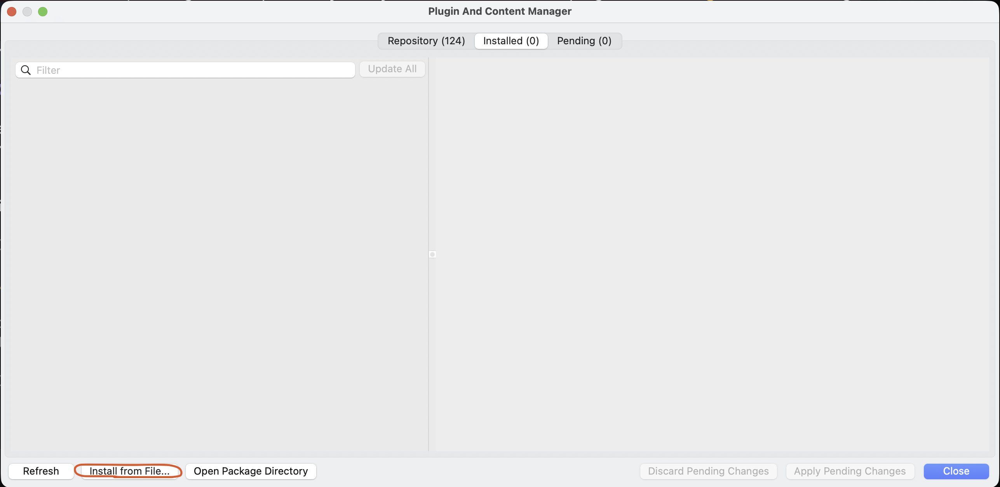
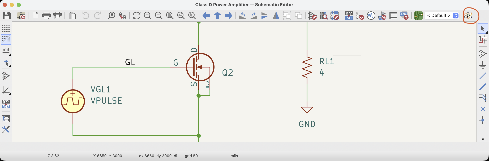

# Xyce Studio

[](https://spice-projects.github.io/xyce-studio/)

Native desktop UI for the Xyce circuit simulator, shipped as a KiCad plugin (launched from the schematic editor over IPC) and as a standalone macOS application for loading netlists, running simulations, and visualizing output.

**Xyce Studio is not a simulator** — it drives the [Xyce](https://xyce.sandia.gov/) executable from Sandia National Labs, which you install separately.


## Features

- SPICE-style netlist editor with syntax coloring
- Simulation command dialog supporting Transient, AC, DC, Harmonic Balance, Noise, Operating Point, and Linear analyses
- Interactive charts with expression plotting, zoom, FFT calculations, and parametric step filtering
- Persistent plugin configuration for the Xyce executable path
- IPC integration with KiCad via NNG and the vendored KiCad protobuf API

## Documentation

The full user documentation is at **https://spice-projects.github.io/xyce-studio/** — installation, first simulation tutorial, user guide (simulations, waveform viewer, KiCad integration), troubleshooting, and build instructions.

This README only covers the KiCad plugin installation; see the documentation site for the complete guide.

## Installation

### KiCad plugin

#### Step 1: Enable KiCad API

1. Open KiCad
2. Go to **Preferences** → **Settings** → **API**
3. Enable **KiCad API**


#### Step 2: Restart KiCad

Restart KiCad so the KiCad API server is available.

#### Step 3: Download the plugin package

https://github.com/spice-projects/xyce-studio/releases/latest

Download the package for your platform: `kicad-xyce-plugin-macos.zip` or `kicad-xyce-plugin-windows.zip`.

#### Step 4: Install the plugin from file

1. Open KiCad
2. Go to **Tools** → **Plugin Manager** (or **Preferences** → **Plugin Manager**)
3. Click **Install from File...** and select the downloaded plugin `.zip` file



#### Step 5: Restart KiCad

Restart KiCad so the newly installed plugin is loaded and registered.

#### Step 6: Open Xyce Studio from the schematic toolbar

Open a schematic project. The plugin appears as a toolbar button in the schematic editor — click it to launch the simulator.



### Standalone app (macOS)

Download `xyce-studio-macos.zip` from the [latest release](https://github.com/spice-projects/xyce-studio/releases/latest), unzip it, and drag `Xyce Studio.app` to your Applications folder. The standalone app does not connect to KiCad: it opens netlist files, runs simulations with Xyce, and visualizes the output, and it can also open Xyce simulation output files directly.

## Building from Source

Requires a C++23 compiler, CMake 3.25+, and vcpkg-managed dependencies (see `vcpkg.json`). Build with:

```bash
cmake --preset debug
cmake --build --preset debug
```

Run the built binary directly for standalone mode, or launch it from KiCad over IPC (`KICAD_API_SOCKET`/`KICAD_API_TOKEN`). The full developer guide — presets, application modes, tests, and building the KiCad package — is at [Building from Source](https://spice-projects.github.io/xyce-studio/development/building/).

## Contributing

See [CONTRIBUTING.md](CONTRIBUTING.md).

## License

Project source code is licensed under Apache-2.0. See LICENSE.

This repository also bundles third-party icon assets from KiCad under CC-BY-SA 4.0 in kicad-icons (and `src/ui/kicad-icons`). See:

- kicad-icons/LICENSE
- kicad-icons/COPYING
- THIRD_PARTY_NOTICES.txt

This repository also bundles third-party Xyce documentation PDFs in xyce-docs. See:

- xyce-docs/Xyce_RG.pdf
- xyce-docs/Xyce_UG.pdf
- xyce-docs/COPYING.XYCE
- THIRD_PARTY_NOTICES.txt

When redistributing this project, include the project LICENSE file and all third-party license and notice files listed above.

Dependencies (Slint, spdlog, protobuf, NNG, pocketfft, GoogleTest) are third-party components distributed under their own licenses. See THIRD_PARTY_NOTICES.txt for attribution and redistribution notes.
