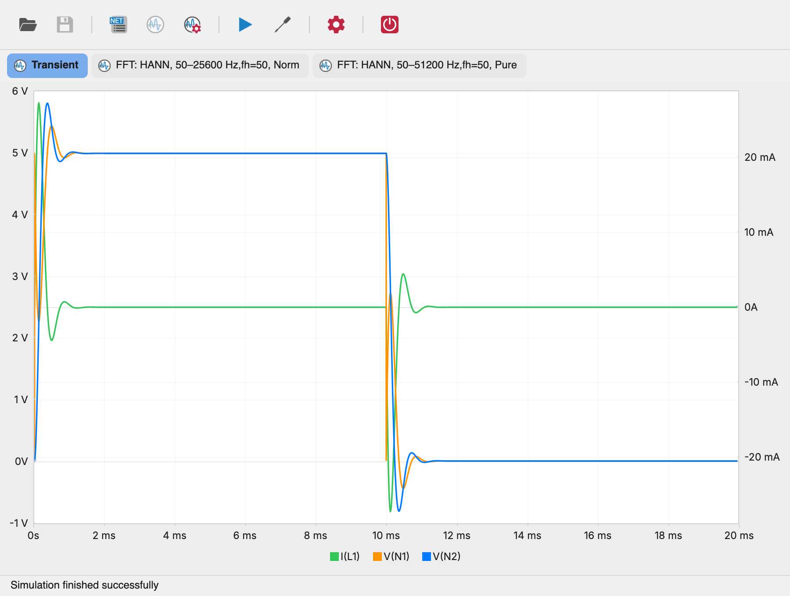
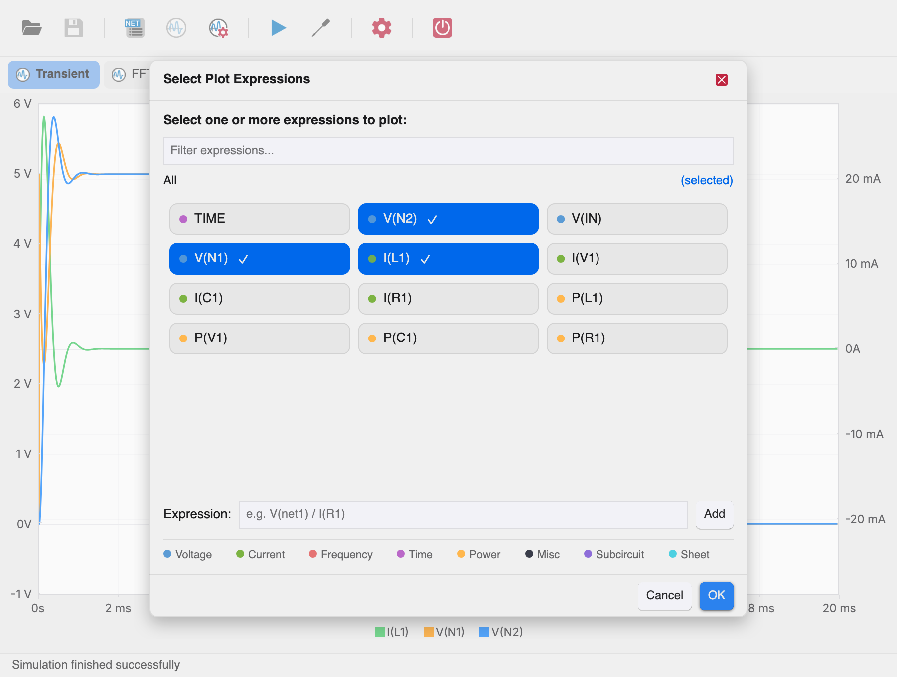

# First Simulation

This tutorial walks through one simulation from an empty window to a
plotted waveform. It uses `tran-simple-01.cir`, a small series RLC circuit
that ships in the repository's [netlists/](https://github.com/spice-projects/xyce-studio/tree/main/netlists)
directory:

```spice
V1 IN 0 PULSE(0 5 0 1n 1n 10m 20m)
R1 IN N1 100
L1 N1 N2 10mH
C1 N2 0 1uF

.PREPROCESS REPLACEGROUND TRUE
.TRAN 1u 20m 0
.PRINT TRAN FORMAT=RAW FILE=tran-simple-01.raw V(*) I(*) P(*)
.FFT I(L1) NP=1024 WINDOW=HANN
.FFT I(C1) NP=1024 WINDOW=HANN
.FFT I(C1) NP=2048 WINDOW=HANN FORMAT=UNORM

.END
```

It is a 5 V pulse source driving a series R-L-C ladder, simulated for
20 ms of transient response.

## Before you start

- Xyce is installed on your machine (see [Installation](installation.md)).
- Xyce Studio runs and its executable path is configured (see
  [Configuring the Xyce Executable](../user-guide/configuration.md)).

## 1. Open the netlist

Launch Xyce Studio in standalone mode. Click **Open** in the toolbar and
select `tran-simple-01.cir` (or any other netlist file you have).


The netlist appears in the editor with line numbers and coloring. You can
change values before running: for example, change `10mH` to `5mH` — the
window title shows a `*` prefix when there are unsaved edits, and the
**Save** tool persists them to the `.cir` file.

## 2. Configure the analysis

The netlist already contains its own `.TRAN` line, so you could run it
as-is. To configure the analysis from the UI instead, click
**Configure**:


Set **Initial step** to `1u` and **Final time** to `20m`, enable
**.PRINT output**, and click **OK**. The resulting directives are merged
into the netlist before `.END`, and the simulation runs with them.

## 3. Run the simulation

Click **Run Simulation**. The status bar reports the progress —
`Simulation started...`, then `Simulation finished successfully` — and
the charts panel opens automatically.



## 4. Plot some signals

A fresh chart starts empty: right-click the chart and choose
**Add/Remove Plots** to pick what to display. The expressions available
come from the `.PRINT` line — this run prints all node voltages and
device currents.



Click a couple of expression chips (for example `V(IN)` and `V(N2)`),
then **OK**. Each signal becomes a colored series with a legend below the
chart.

## 5. Inspect the waveform

Hover the plot to read values in the status bar, and drag a rectangle
inside the chart to zoom into a region — other charts in the tab follow
the same horizontal window, which makes comparing signals easy.

## 6. Modify and rerun

Edit the netlist (for example change the pulse period from `20m` to
`40m`), click **Save**, then **Run Simulation** again. New results
replace the previous ones and the charts refresh.

If something goes wrong — Xyce reports a parse error, or the charts stay
empty — check the [Troubleshooting](../user-guide/troubleshooting.md)
page and the output shown by the **Sim Output** toolbar tool.
