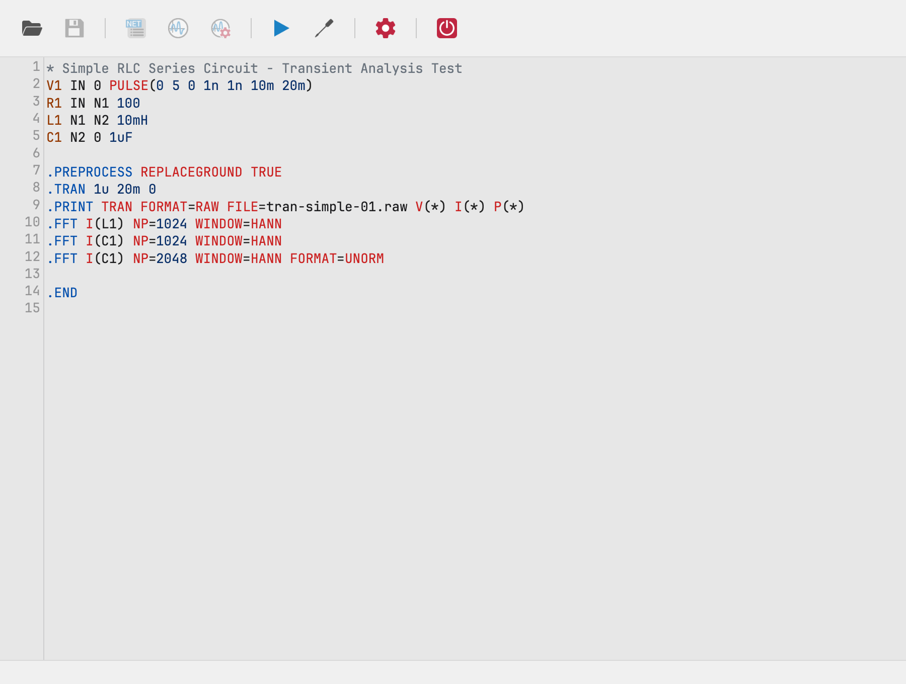

# Xyce Studio

**Xyce Studio** is a graphical simulation environment for the [Xyce](https://xyce.sandia.gov/)
circuit simulator: load a circuit, run a simulation, and inspect the results
as interactive waveforms — in one native desktop window.

It ships in two forms:

- **A KiCad plugin** — launched directly from the [KiCad](https://www.kicad.org/)
  schematic editor. The schematic is netlisted automatically and handed to
  Xyce Studio, so you can go from schematic to simulation results without
  leaving KiCad.
- **A standalone application** (macOS) — open Xyce netlist files (`.cir`)
  or simulation output files directly, edit them, and run simulations with
  the Xyce executable on your machine.

> Xyce Studio is **not** a simulator: it drives the [Xyce](https://xyce.sandia.gov/)
> executable from Sandia National Labs, which you install separately.

## Capabilities

- **Netlist editing** — a SPICE-syntax editor with coloring for KiCad mode
  and full editing in standalone mode
- **Simulation setup** — dialogs for the 7 analyses Xyce supports:
  Operating Point, Transient, DC Sweep, AC, Noise, Harmonic Balance and
  Linear (S-parameter) analysis, plus directives (`.STEP`, `.PRINT`,
  `.FFT`, `.FOUR`, `.MEASURE`, `.PCE`)
- **Waveform visualization** — tabbed chart panel with expression plotting,
  box zoom with synchronized charts, parametric-step filtering and FFT
- **KiCad integration** — launches from the schematic toolbar and extracts
  the netlist automatically

## Getting started

1. [Download and install](getting-started/installation.md) — download the
   binary for your platform; install Xyce separately.
2. [Run your first simulation](getting-started/first-simulation.md) — a
   short tutorial using an example netlist.
3. Read the [User Guide](user-guide/index.md) for the complete
   application reference.

## Links

- [Releases](https://github.com/spice-projects/xyce-studio/releases) —
  binaries and the KiCad plugin packages
- [Issue tracker](https://github.com/spice-projects/xyce-studio/issues)
- [FAQ](faq.md)
- [Building from source](development/building.md) for contributors

## License

The source code is licensed under [Apache-2.0](https://github.com/spice-projects/xyce-studio/blob/main/LICENSE);
bundled third-party assets (KiCad icons, Xyce documentation PDFs, libraries)
carry their own licenses — see
[THIRD_PARTY_NOTICES.txt](https://github.com/spice-projects/xyce-studio/blob/main/THIRD_PARTY_NOTICES.txt).
