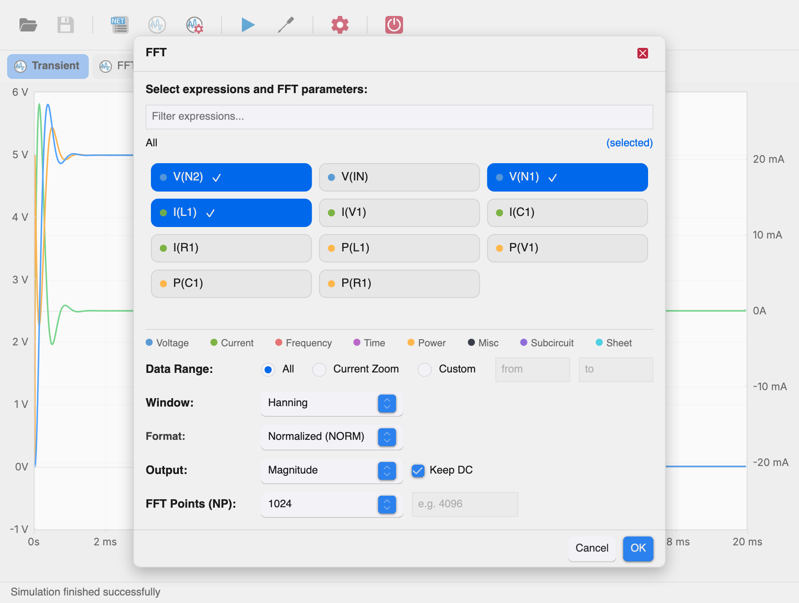
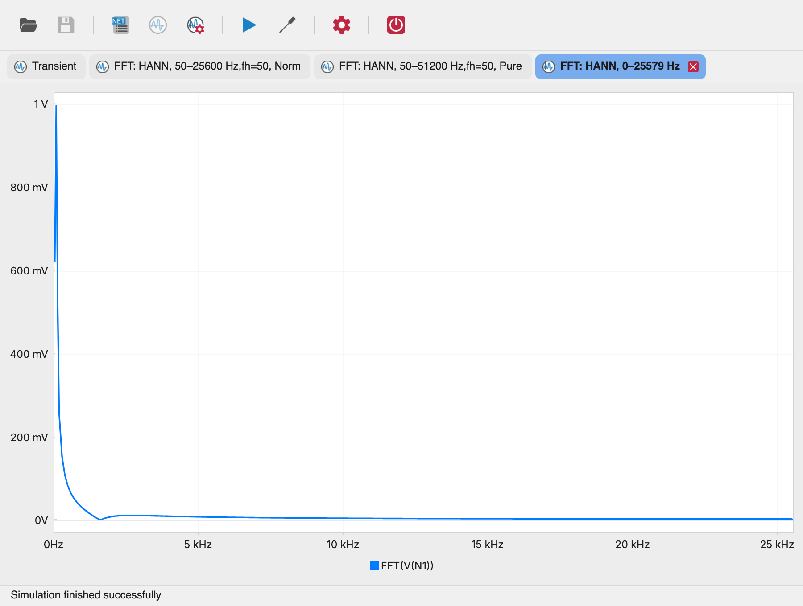
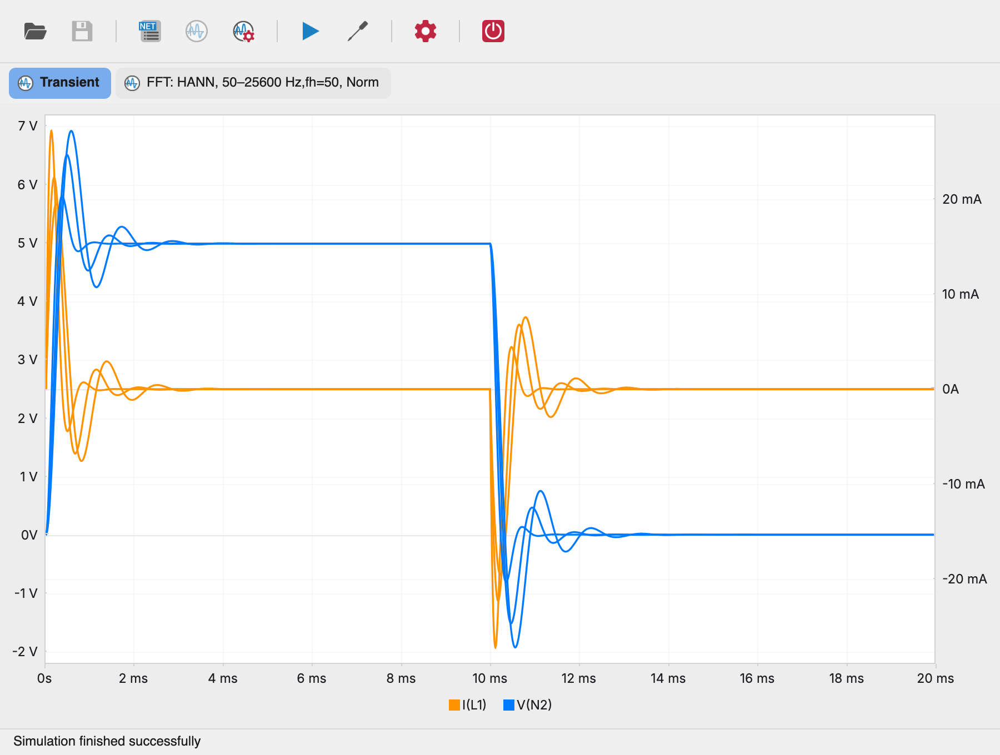
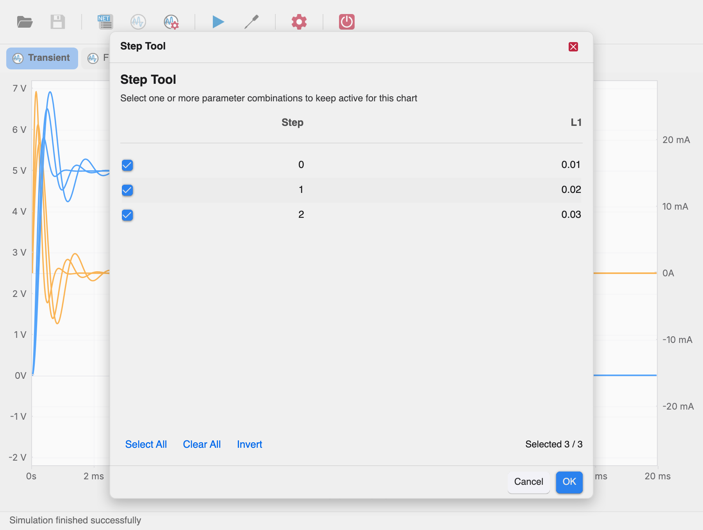

# Viewing Results

After a successful simulation the charts panel opens automatically. You
can also switch to it with the **Charts** toolbar tool, or open a Xyce
simulation output file (`.raw`, `.prn`, `.csv`, `.csd` or `.dat`) directly in
standalone mode.

## Plot tabs

Each dataset gets a tab above the plots: **Transient**, **AC Analysis**,
**DC Sweep**, **DC Operating Point**, **Noise Analysis** — or an FFT tab
named after its parameters (e.g. *FFT: HANN, 50–25600 Hz…*). The tab bar
appears only when there is more than one dataset.

- The simulation result tab is always present and cannot be closed.
- FFT tabs you create are closable with the ✕ on the tab.

## Charts and series

Each tab holds a stack of charts, drawn top to bottom. A chart starts
empty — a fresh simulation shows an empty chart until you choose the
expressions to plot.

### Adding and removing plots

Right-click a chart and choose **Add/Remove Plots**:

- **Filter expressions...** — narrows the chip grid as you type.
- **Scope breadcrumb** — starts at *All*; scope chips drill into
  subcircuits and sheets, each showing how many expressions it contains.
  The *(selected)* link at the right toggles back to show only selected
  expressions.
- **Expression chips** — click to toggle a series on the chart (a ✓ and
  accent border mark selected chips). Right-click a chip to append its
  name to the custom expression field.
- **Custom expressions** — type any expression in the **Expression**
  field and press **Add**, e.g. `V(net1) / I(R1)`. Invalid expressions
  are rejected with *“Invalid expression”*.

Press **OK** to apply the selection. Every selected expression becomes a
series with its own color; the legend below the chart names each series.

Series types are color-coded by signal type: voltage, current,
frequency, time, power, and so on — the legend at the bottom of the
dialog maps the dot colors.

### Chart axes

A chart can show up to three vertical axes (stacked on the right when
series of different magnitudes are combined). The horizontal axis is
shared by all charts in the tab: time for transient results, frequency
for AC/FFT, or the swept variable for DC sweeps.

## Zooming and reading values

### Hover readout

Hovering over a plot area shows a live readout in the status bar:
the abscissa value followed by the value of every plotted series, e.g.
`time=1.2m V(out)=3.45`.

### Zoom

Drag a rectangle inside a chart to zoom. While dragging, a red selection
rectangle is drawn; on release:

- the dragged chart zooms in both the horizontal and vertical range of
  the selection;
- **all other charts** in the tab adopt the horizontal range — making it
  easy to compare the same time or frequency window across charts.

Right-click menu zoom actions:

| Action | Effect |
| --- | --- |
| **Zoom to Fit** | Resets the full zoom window of the clicked chart (horizontal-only reset on the other charts). |
| **Autorange** | Resets the vertical zoom of the clicked chart only. |
| **Zoom Abscissa Extent** | Horizontal-only zoom reset on all charts. |

## FFT of plotted signals

Right-click a chart and choose **Calculate FFT on selected plots** (this
item appears only when the abscissa unit is time, i.e. for transient
results).

- **Expressions** — pick one or more real-valued signals; time
  expressions are not offered.
- **Data Range** — `All` (entire record), `Current Zoom` (the currently
  visible horizontal window), or `Custom` with explicit from/to values.
- **Window** — data window applied before the transform:
  `Rectangular`, `Hamming`, `Hanning` (default), `Blackman`.
- **Format** — `Normalized (NORM)` or `Unnormalized (UNORM)`.
- **Output** — `Magnitude` (default), `Magnitude (dB)`, or `Phase`.
- **Keep DC** — include the DC component in the result (checked by
  default).
- **FFT Points (NP)** — transform length: 256 … 16384, or `Custom...`
  (rounded to the nearest power of two, minimum 4; default 1024).

Click **OK** to compute. The result opens as a new FFT tab (named after
the window and frequency range) with one chart per expression.

Status-bar errors: *“No expressions selected for FFT”*,
*“FFT computation skipped: no data in the selected range”*,
*“FFT computation failed”*.

## Step Tool

When the netlist contains a `.STEP` directive, each series is computed
for every step of the sweep and drawn in the same chart.

Right-click a chart and choose **Step Tool...** to filter which steps
stay active for that chart:

- The table lists every step with the value of each swept parameter.
- Click a row (or its checkbox) to include/exclude it.
- **Select All**, **Clear All**, **Invert** act on the whole table; the
  footer shows `Selected N / M`.

Click **OK** to redraw the chart with only the selected step curves.

## Managing charts

All chart management lives in the right-click context menu of a chart:

| Action | Effect |
| --- | --- |
| **Add Chart** | Inserts a new empty chart directly after the clicked one. |
| **Delete Chart** | Removes the clicked chart (the panel always keeps at least one). |
| **Delete All Plots** | Clears every series of the clicked chart. |
| **New Window** | Opens an independent window with the same dataset — handy for comparing two zoom windows side by side. |

Charts can be **reordered** by dragging: grab the ☰ grip in the
top-right corner of a chart and drop it between two charts — a blue
drop indicator shows the insertion point while dragging.
