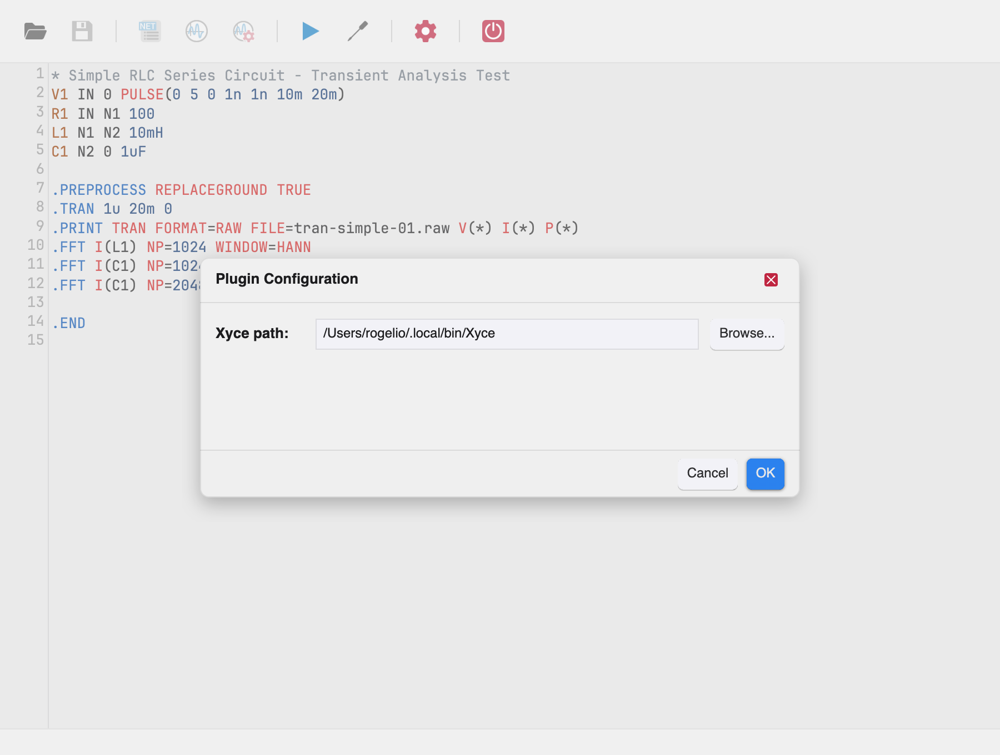

# Configuring the Xyce Executable

Xyce Studio runs simulations by driving the **Xyce** executable. Before
the first simulation you must tell it where that executable lives.

Open the plugin configuration dialog with the **Plugin Settings** toolbar
tool.

- **Xyce path** — the full path to the Xyce executable.
- **Browse...** — opens a file picker to select the executable.

Click **OK** to save. The path is remembered across sessions.

## Validation

The dialog refuses to accept:

- an empty path — *“Xyce executable path is required”*
- a file that is not an executable — *“Selected path is not an executable
  file”*

Errors appear in red above the **Cancel**/**OK** buttons. **Cancel**,
**Escape**, or the ✕ button closes the dialog without saving.
