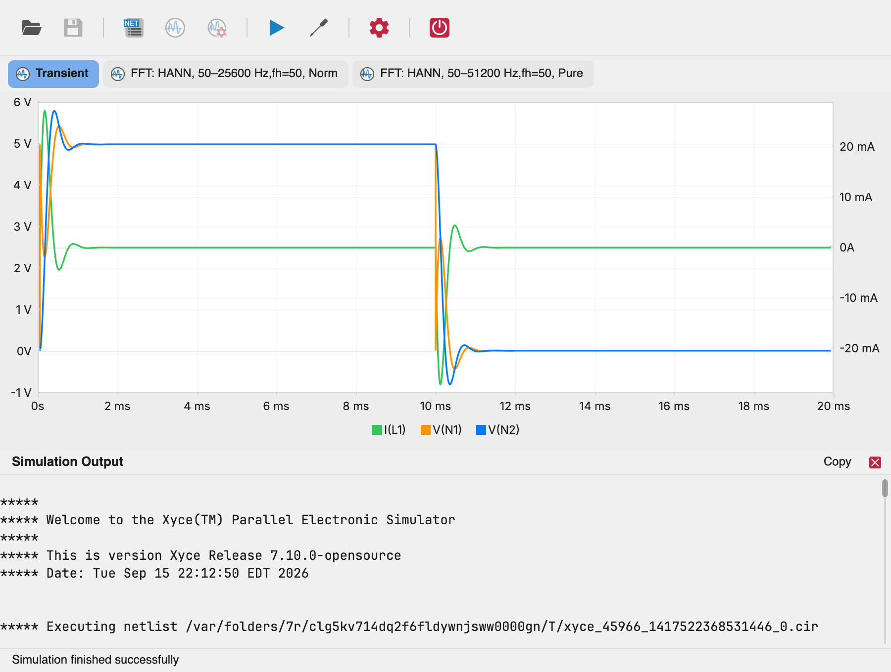

# The Main Window

The main window has four areas:

- the **toolbar** at the top,
- the **netlist editor** in the center,
- the **charts panel** (shown after a simulation or when opening a
  simulation output file — `.raw`, `.prn`, `.csv` or `.csd`), and
- the **status bar** at the bottom.

The window title shows the netlist or schematic file name. When the
netlist has unsaved edits, a `* ` prefix appears in the title.

## Toolbar

From left to right:

| Tool | Action |
| --- | --- |
| **Open** | Open a Xyce file (`.cir` netlist, or a simulation output: `.raw`, `.prn`, `.csv`, `.csd`). Standalone mode only. |
| **Save** | Save the netlist. Enabled only when the editor has unsaved changes. |
| **Netlist** | Show the netlist editor. |
| **Charts** | Show the charts panel. |
| **Sim Output** | Show or hide the simulation output panel. |
| **Run Simulation** | Run the simulation. While a simulation is running, this becomes a red **Stop Simulation** button that cancels the run. |
| **Configure** | Open the simulation parameters dialog. |
| **Plugin Settings** | Open the plugin configuration dialog (Xyce executable path). |
| **Exit** | Close the application. |

When launched from KiCad, **Open** and **Save** are disabled — the netlist
belongs to the schematic and is re-extracted on every launch.

## Netlist editor

The editor shows the Xyce netlist with line numbers and syntax coloring:
component references and values, node names, and directives (`.TRAN`,
`.PRINT`, `.FFT`, ...) are color-coded so netlist structure is easy to
scan. It is a standard text editor — click to place the caret, drag to
select, and use the usual clipboard shortcuts.

After editing, the title is marked dirty (a `* ` prefix appears) and the
toolbar **Save** tool becomes available. Saved edits persist to the
`.cir` file.

## Simulation output panel

The **Sim Output** toolbar tool toggles the simulation output panel: a
monospaced log of the Xyce run, including the simulator banner, warnings,
and measurement results. It is useful for diagnosing convergence
problems and for reading `.MEASURE` results.

- Click a line to select it; shift-click or drag to select a range.
- **Cmd/Ctrl+C** copies the selection, or the whole log when nothing is
  selected; **Cmd/Ctrl+A** selects everything.
- The **Copy** button does the same as the keyboard shortcut.
- The panel keeps its content after being closed and reopened.

## Status bar

The status bar reports the current state: `Simulation started...`,
`Simulation finished successfully`, `Simulation failed (exit code N)`,
`Simulation canceled`, and specific errors such as
`Configured Xyce executable path is invalid`. While you hover the mouse
over a chart, the status bar temporarily shows a readout of the values
under the cursor (see [Viewing Results](charts.md)).
