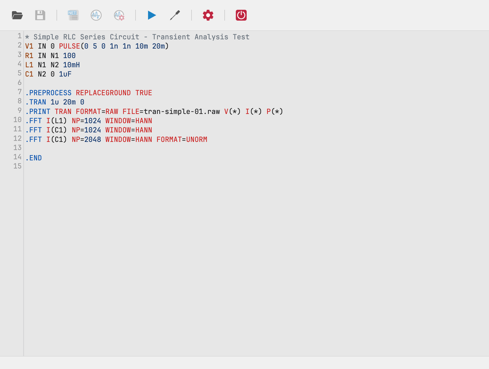
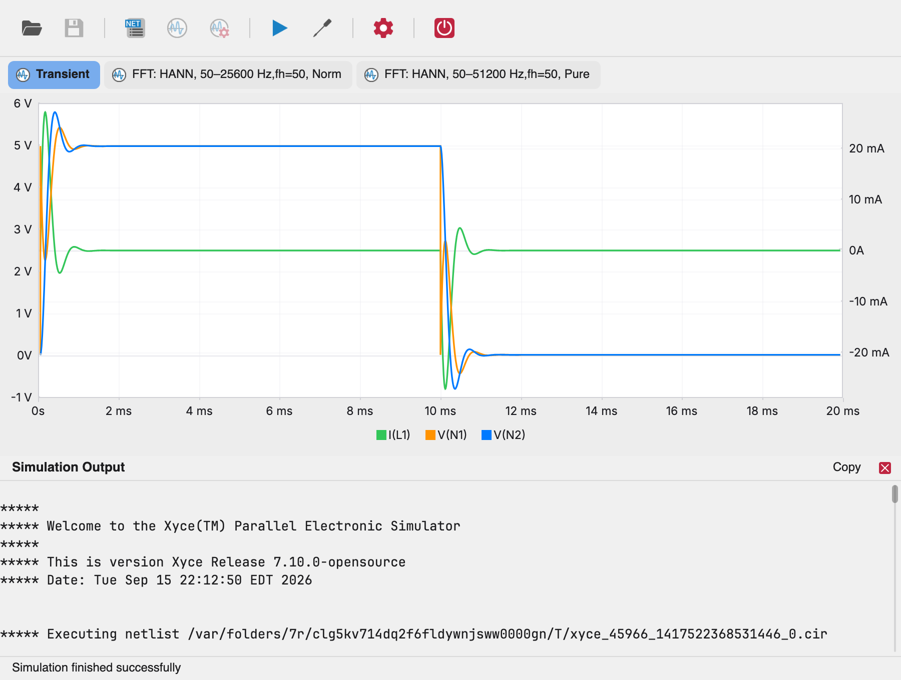

# The Main Window

The main window has four areas:

- the **toolbar** at the top,
- the **netlist editor** in the center,
- the **charts panel** (shown after a simulation or when opening a
  simulation output file — `.raw`, `.prn`, `.csv`, `.csd` or `.dat`), and
- the **status bar** at the bottom.

The window title shows the netlist or schematic file name. When the
netlist has unsaved edits, a `* ` prefix appears in the title.

## Toolbar

From left to right:

| Tool | Action |
| --- | --- |
| **Open** | Open a Xyce file (`.cir` netlist, or a simulation output: `.raw`, `.prn`, `.csv`, `.csd`, `.dat`). Standalone mode only. |
| **Save** | Save the netlist. Enabled only when the editor has unsaved changes. |
| **Netlist** | Show the netlist editor. |
| **Charts** | Show the charts panel. |
| **Sim Output** | Show or hide the simulation output panel. |
| **Run Simulation** | Run the simulation. While a simulation is running, this becomes a red **Stop Simulation** button that cancels the run. |
| **Configure** | Open the simulation parameters dialog. |
| **Options** | Open the Xyce options dialog to view and edit the `.OPTIONS` package values. |
| **Plugin Settings** | Open the plugin configuration dialog (Xyce executable path). |
| **Exit** | Close the application. |

When launched from KiCad, **Open** and **Save** are disabled — the netlist
belongs to the schematic and is re-extracted on every launch.

## Netlist editor

The editor shows the Xyce netlist with line numbers and syntax coloring:
component references and values, node names, and directives (`.TRAN`,
`.PRINT`, `.FFT`, ...) are color-coded so netlist structure is easy to
scan. It is a standard text editor — click to place the caret, drag to
select, and use the usual clipboard shortcuts.

After editing, the title is marked dirty (a `* ` prefix appears) and the
toolbar **Save** tool becomes available. Saved edits persist to the
`.cir` file.

## Simulation output panel

The **Sim Output** toolbar tool toggles the simulation output panel: a
monospaced log of the Xyce run, including the simulator banner, warnings,
and measurement results. It is useful for diagnosing convergence
problems and for reading `.MEASURE` results.

- Click a line to select it; shift-click or drag to select a range.
- **Cmd/Ctrl+C** copies the selection, or the whole log when nothing is
  selected; **Cmd/Ctrl+A** selects everything.
- The **Copy** button does the same as the keyboard shortcut.
- The panel keeps its content after being closed and reopened.
- Lines Xyce reported as a warning are amber and lines it reported as an
  error are red, so the reported problems stand out from the ordinary
  progress output.
- The header carries the `N warnings` and `N errors` counts whenever the
  run reported any. Clicking a count scrolls the log to the first
  occurrence and selects it.

## Status bar

The status bar reports the current state: `Simulation finished
successfully`, `Simulation failed (exit code N)`, `Simulation canceled`,
and specific errors such as `Configured Xyce executable path is
invalid`. While you hover the mouse over a chart, the status bar
temporarily shows a readout of the values under the cursor (see
[Viewing Results](charts.md)).

While a simulation is running, a progress indicator appears on the right
of the status bar and the message area on the left is left empty:

- a **progress bar** with the completion percentage and Xyce's own
  estimate of the remaining time, for example `62% · ETA 14 sec.`. Xyce
  reports progress for a transient analysis only, so a DC sweep, an AC,
  a harmonic balance or an operating point run shows an indeterminate bar
  and the elapsed time instead (`9s elapsed`).
- the **warning and error counts** Xyce reported so far, colour-coded
  like the log lines they refer to.
- the whole status bar is a shortcut: **clicking it opens the simulation
  output panel** so you can watch the live log without leaving the view
  you are working in.

The percentage comes from the `***** Percent complete:` markers Xyce
writes to its console log; the estimated time is Xyce's own estimate and
moves as the run learns how long a time step takes.
