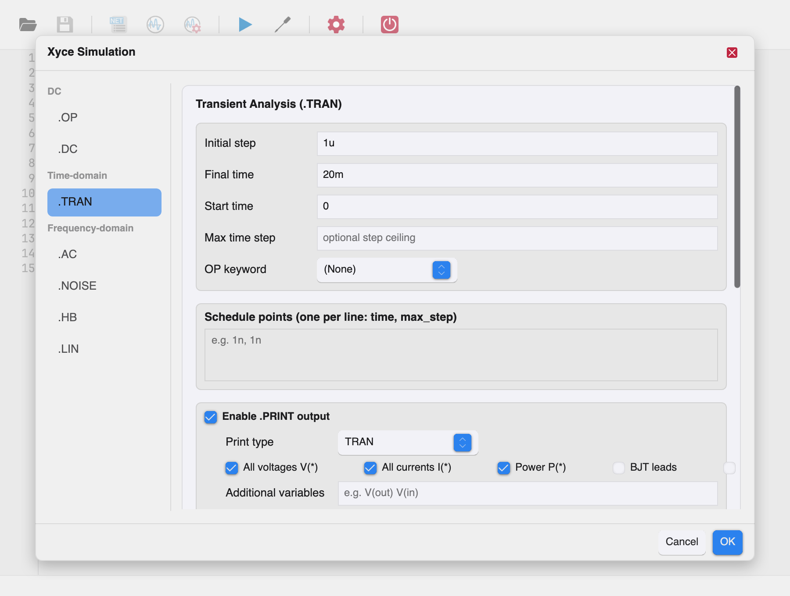
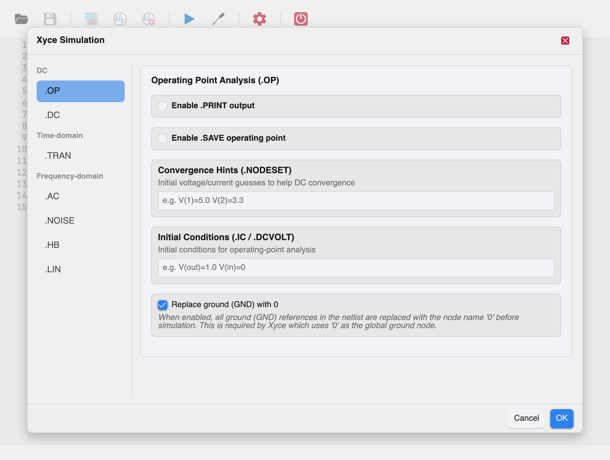
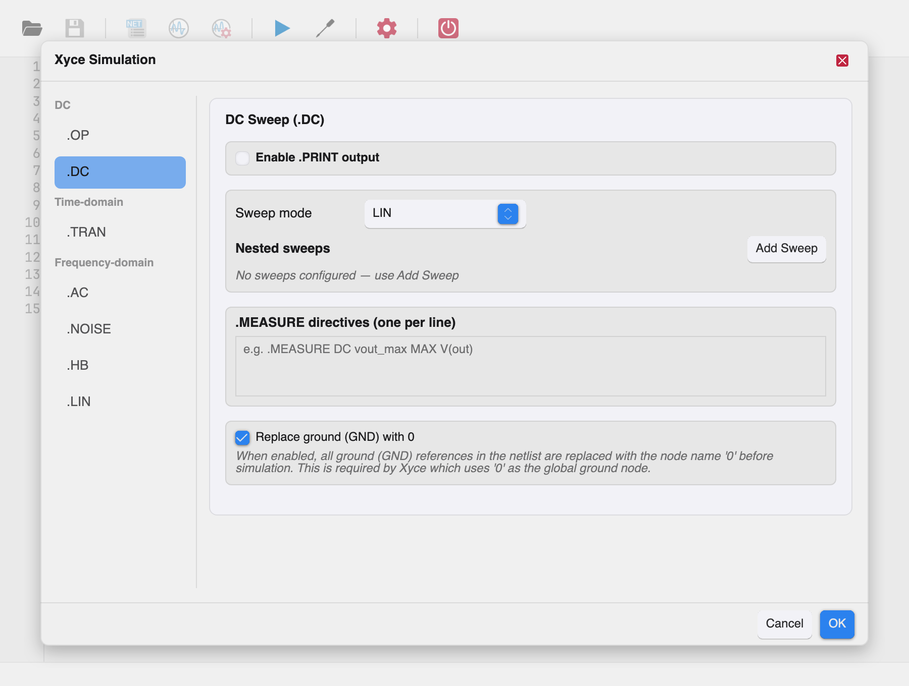
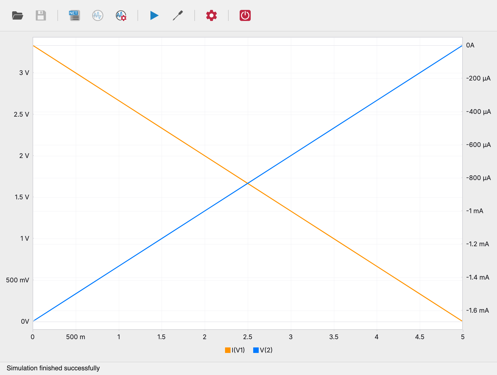
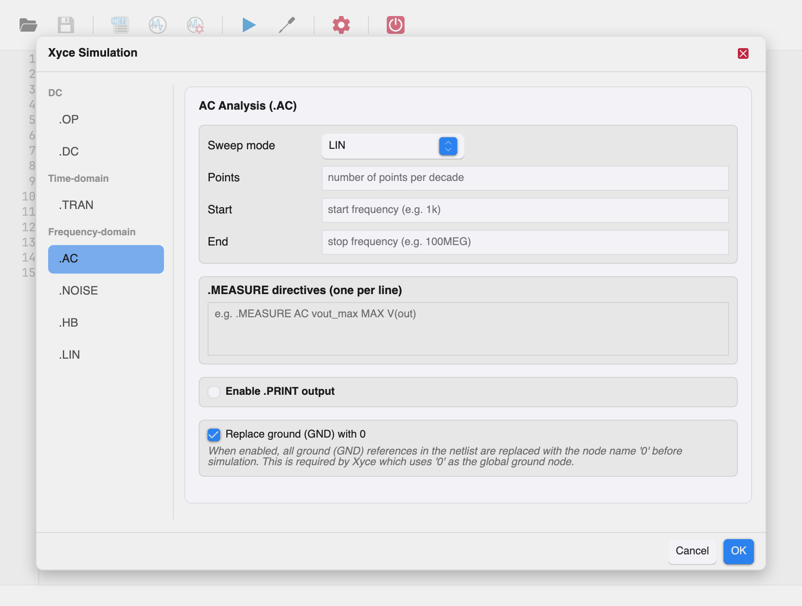
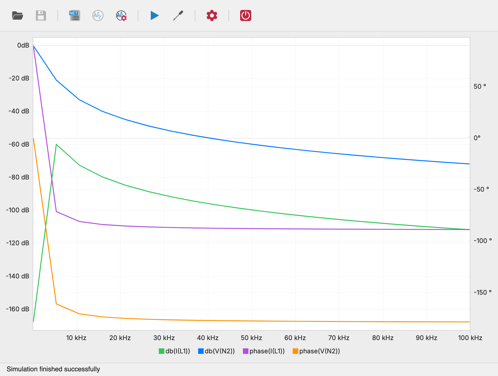
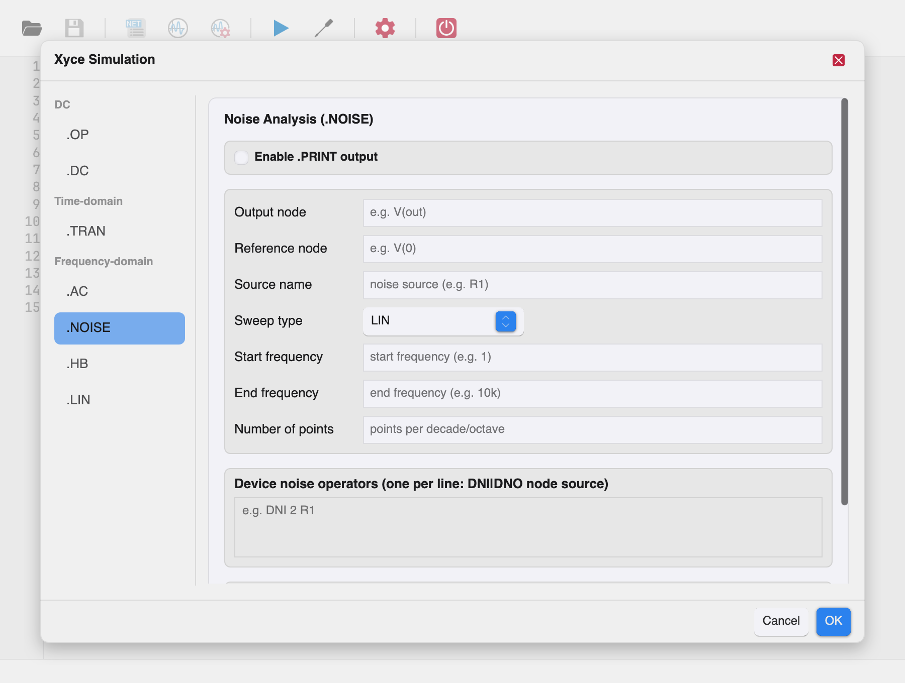
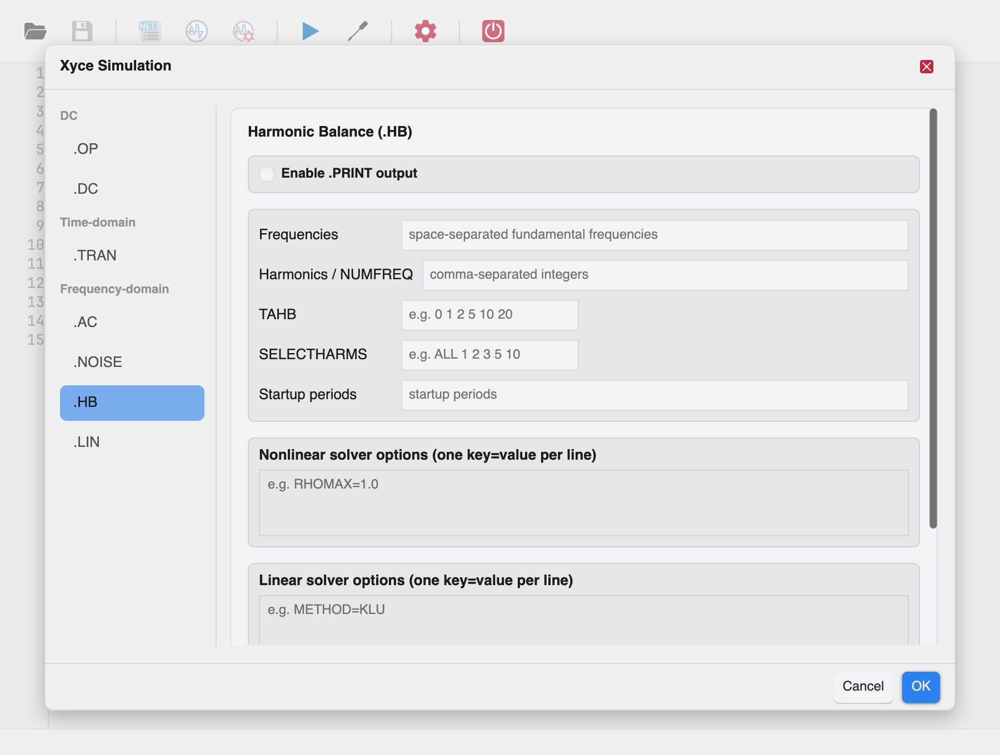
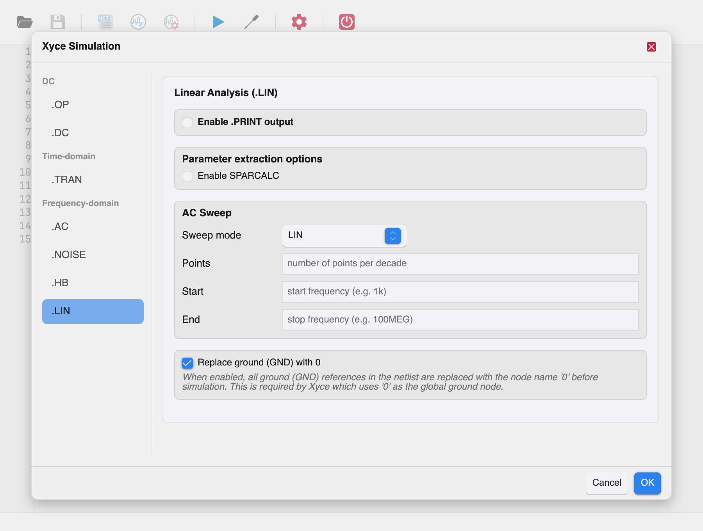

# Running Simulations

Open the simulation parameters dialog with the **Configure** toolbar tool
(the title is *Xyce Simulation*). Parameters are organized in a vertical
tab bar on the left, grouped by domain:

- **DC** — `.OP`, `.DC`
- **Time-domain** — `.TRAN`
- **Frequency-domain** — `.AC`, `.NOISE`, `.HB`, `.LIN`



Click **OK** to apply the settings; the accepted directives are merged
into the netlist (before `.END`) and the simulation runs with them.
**Cancel**, **Escape**, or the ✕ button closes the dialog and discards
changes. Invalid input keeps the dialog open with the error shown in red
above the footer buttons.

**Tip:** clicking **Run Simulation** with no analysis configured opens
this dialog first; the simulation starts after you accept it.

## Ground node handling

Every analysis tab offers **Replace ground (GND) with 0** (checked by
default). When enabled, all `GND` references in the netlist are replaced
with the node name `0` before simulation. This is required by Xyce,
which uses `0` as the global ground node. Leave it on unless your
netlist already uses `0` for ground.

## Time and frequency values

All numeric fields accept standard SPICE engineering suffixes: `1n`,
`25m`, `5u`, `10MEG`, `1G`, ...

---

## Operating Point (.OP)



The operating point analysis computes the DC bias point of the circuit:
all node voltages with the independent sources at their nominal values.

### .PRINT output options

Enable **.PRINT output** to generate a printable output file of the
operating point, then select what to include:

| Option | Meaning |
| --- | --- |
| **All voltages V(\*)** | Every node voltage |
| **All currents I(\*)** | Every source/device current |
| **Power P(\*)** | Device power dissipation |
| **BJT leads** | BJT lead currents |
| **FET leads** | FET lead currents |
| **Additional variables** | Free-form list, e.g. `V(out) V(in)` |

- **Format** — output file format: `STD`, `NOINDEX`, `PROBE`, `TECPLOT`,
  `RAW`, `CSV`, `GNUPLOT`, `SPLOT`. `(default)` uses the Xyce default
  (STD). See the [Xyce reference guide][rg] for format details.
- **Output file** — optional explicit path for the print file.
- **Extra options** — additional `.PRINT` options as `KEY=VALUE` pairs,
  e.g. `WIDTH=20 PRECISION=12`.

### Save operating point (.SAVE)

Enable **.SAVE operating point** to write the converged bias point to a
file for reuse in later runs (quick DC convergence of difficult
circuits):

- **Save as .NODESET / Save as .IC** — the file is written as `.NODESET`
  or `.IC` lines.
- **Save file** — optional output path.
- **Level** — `all` or `none`. Note: if left at `(default)`, Xyce creates
  no save file.

### Convergence hints (.NODESET)

Initial voltage guesses to help the DC solver converge, e.g.
`V(1)=5.0 V(2)=3.3`. Xyce runs two solves: one holding the given values
as initial conditions, and one unconstrained starting from that
solution. Only voltages can be specified.

### Initial conditions (.IC / .DCVOLT)

Conditions enforced *for the entire* operating-point solve, e.g.
`V(out)=1.0 V(in)=0`. Nodes not listed are free to converge. Only
voltages can be specified; unsolvable combinations are possible — see
the Xyce Users' Guide for guidance.

---

## Transient (.TRAN)


The transient analysis computes the circuit response over an interval of
time.

### Time stepping

| Field | Meaning |
| --- | --- |
| **Initial step** | Initial time step, e.g. `1n`. Xyce picks the actual first step as the smallest of this value, the step ceiling, and 1/200th of the time to the next breakpoint. |
| **Final time** | Simulation end time, e.g. `1u`. |
| **Start time** | Optional. Time at which output starts; simulation always begins at t=0 regardless. Defaults to 0. |
| **Max time step** | Optional ceiling on the time step. Defaults to (final − start)/10, automatically refined around breakpoints. |
| **OP keyword** | `NOOP` (or its synonym `UIC`): skip the initial bias-point calculation and start from the specified initial conditions (`.IC` lines or capacitor `IC` parameters); unspecified values default to zero. `(None)` performs the normal bias-point calculation. |

**Note:** unlike classic SPICE, the first number on the `.TRAN` line is
the *initial step*, not the print interval.

### Schedule points

The **Schedule points** field accepts one `time, max_step` pair per
line, e.g. `1n, 1n`. This produces a `{schedule(...)}` clause: a maximum
time step of `max_step` is enforced while simulation time is between
`time` and the next listed time. A zero or negative step means no
enforced limit for that interval.

### Directives

- **.FFT directives** — one per line, e.g.
  `.FFT V(out) START=1n STOP=1u NP=1024`. See
  [.FFT syntax](#fft-directives) below.
- **.FOUR directives** — one per line, e.g. `.FOUR 1e6 V(out)`. See
  [.FOUR syntax](#four-directives).
- **.MEASURE directives** — one per line, e.g.
  `.MEASURE TRAN vout_max MAX V(out)`. See
  [.MEASURE syntax](#measure-directives).

### .PRINT output options

Same options as [Operating Point](#print-output-options) plus a **Print
type** selector: `TRAN` (normal transient output) or `TRANADJOINT`
(transient adjoint sensitivity output). The print type defaults to
`TRAN`.

---

## DC Sweep (.DC)



The DC sweep analysis steps one or more circuit parameters and computes
the bias point at each value.

### Sweep modes

| Mode | Fields | Meaning |
| --- | --- | --- |
| `LIN` | Start, Stop, Step | Linear sweep from start to stop in increments of step. If stop < start, the step must be negative. |
| `DEC` | Start, Stop, Points | Logarithmic sweep by decades; *Points* is the number of points per decade. Stop must be larger than start. |
| `OCT` | Start, Stop, Points | Logarithmic sweep by octaves; *Points* is the number of points per octave. Stop must be larger than start. |
| `LIST` | — | Explicit list of values (configured in the nested sweeps table). |
| `DATA` | Data table | Sweeps from a `.DATA` table defined in the netlist. |

### Nested sweeps

The **Add Sweep** button appends sweep rows; each row is one nested
sweep dimension. A row contains:

- **Variable** — the swept source/parameter name, e.g. `V1`, `R1`, `TEMP`.
- **Start / Stop** — sweep range.
- **Step** (LIN only) or **Points** (DEC/OCT) or **List values**
  (LIST, space-separated, e.g. `0 1 2 5`).

Multiple rows produce nested sweeps (all combinations of the outer
sweep with each inner sweep).



### Validation

The dialog reports errors such as:

- `DC DATA sweep requires a data table name`
- `DC <MODE> sweep requires at least one sweep variable`
- per-row errors: `sweep variable is required`, `start value is
  required`, `stop value is required`, `step value is required`,
  `points value is required`, `points value must be a positive
  integer`, `start value must be greater than zero`.

A rejected **OK** keeps the dialog open so you can correct the input;
**Cancel** still discards everything.

### Directives and .PRINT

- **.MEASURE directives** as for transient, e.g.
  `.MEASURE DC vout_max MAX V(out)`.
- **Print type**: `DC` or `HOMOTOPY`; includes the Power option.

### Uncertainty quantification (.PCE)

The DC and transient pages carry a shared **Uncertainty quantification
(.PCE)** section (Xyce Reference Guide §2.1.27). `.PCE` runs a fully
intrusive Polynomial Chaos Expansion on top of the `.DC` or `.TRAN`
analysis: the circuit is evaluated at quadrature points of the
distribution and the uncertainty propagates from inputs to outputs.

- **Uncertain parameters** — one row per sampled parameter with a name
  (any parameter valid for `.STEP`), a distribution type and two value
  fields: `uniform` → lower/upper bounds, `normal` → mean/standard
  deviation, `gamma` → alpha/beta.
- **Expression-based inputs (useExpr)** — when enabled, the random
  inputs come from expression operators such as `AGAUSS` and `AUNIF`
  and the parameter table is ignored.
- **.OPTIONS PCES package** — one `key=value` entry per line; the
  required `OUTPUTS` entry lists the outputs for which statistics are
  computed (e.g. `OUTPUTS={V(out)}`); further entries are `COVMATRIX`,
  `SAMPLE_TYPE`, `SEED`, `OUTPUT_SAMPLE_STATS`, `RESAMPLE`,
  `OUTPUT_PCE_COEFFS`, `SPARSE_GRID` and `STDOUTPUT`.
- **.PRINT PCE output** — enables the companion print directive; extra
  options accept `OUTPUT_SAMPLE_STATS=true` (mean, meanplus, meanminus,
  stddev and variance) and `OUTPUT_ALL_SAMPLES=true` (all quadrature
  points).

The dialog rejects a PCE configuration with mismatched list lengths or
missing distribution values (e.g. `PCE parameter R1: a normal
distribution requires means`) and keeps the dialog open for corrections.

---

## AC Analysis (.AC)



AC analysis linearizes the circuit around its DC bias point and
computes the frequency response over a range of frequencies.

### Sweep

| Field | Meaning |
| --- | --- |
| **Sweep mode** | `LIN` (linear), `DEC` (per decade), `OCT` (per octave), or `DATA` (values from a `.DATA` table). |
| **Points** | Number of points per decade/octave (DEC/OCT) or in the sweep (LIN). Integer ≥ 1. |
| **Start / End** | Frequency range in Hz, e.g. `1k` … `100MEG`. End must not be less than start; both must be greater than zero. |

Switching the sweep mode clears the fields of the previous mode.



**Note:** sweeping magnitude and phase of an AC source with `DATA` is
supported, but nonlinear device parameters cannot be swept inside AC
analysis — use a `.STEP` directive for that.

### Directives and .PRINT

- **.MEASURE directives** e.g. `.MEASURE AC vout_max MAX V(out)`.
- **Print type**: `AC` or `AC_IC` (AC initial conditions). Power
  calculations are not available for AC analysis.

---

## Noise (.NOISE)



Noise analysis computes the small-signal noise response of the circuit
over a range of frequencies, linearized around the bias point.

### Noise configuration

| Field | Meaning |
| --- | --- |
| **Output node** | Node where total output noise is measured, e.g. `V(out)`. |
| **Reference node** | Optional. Noise is computed as V(output) − V(ref); defaults to ground. |
| **Source name** | Name of the independent source the input noise is referred to, e.g. `VIN`. |
| **Sweep type** | `LIN`, `DEC`, `OCT`, or `DATA`. |
| **Start frequency / End frequency** | Frequency range; end must not be less than start, both greater than zero. |
| **Number of points** | Points per decade/octave (DEC/OCT) or in the sweep (LIN). Integer ≥ 1. |
| **Data table** | `.DATA` table name (for the `DATA` sweep type). |

### Device noise operators

The **Device noise operators** field accepts one `DNI|DNO node source`
line per requested contribution, e.g. `DNI 2 R1` — input-referred
(`DNI`) or output-referred (`DNO`) noise of a specific device.

**Note:** noise analysis is a relatively new Xyce feature; not all
device noise models are supported. Power is not available for noise
analysis. The print type is fixed to `NOISE`.

---

## Harmonic Balance (.HB)



Harmonic balance computes the steady-state magnitude and phase of
voltages and currents in a nonlinear circuit driven by periodic
sources.

### Frequency configuration

| Field | Meaning |
| --- | --- |
| **Frequencies** | Space-separated fundamental frequencies, e.g. `1e4 2e2`. |
| **Harmonics / NUMFREQ** | Comma-separated integers selecting the harmonics to solve for. |
| **TAHB** | HB time-step schedule values, e.g. `0 1 2 5 10 20`. |
| **SELECTHARMS** | Harmonic selection, e.g. `ALL 1 2 3 5 10`. |
| **Startup periods** | Number of startup periods simulated before the steady-state solve. |

### Solver options

- **Nonlinear solver options** — one `KEY=VALUE` pair per line, e.g.
  `RHOMAX=1.0`.
- **Linear solver options** — one `KEY=VALUE` pair per line, e.g.
  `METHOD=KLU`.

The available keys are documented in the [Xyce reference guide][rg]
(`.OPTIONS NONLIN-HB` and `.OPTIONS LIN`).

**Note:** time-dependent B sources (and the same restriction applies to
E/F/G/H dependent sources in their time-dependent use) do not work with
HB analysis. Purely dependent usage works. The print type options are
`HB` (default), `HB_FD` (frequency domain), and `HB_TD` (time domain).

---

## Linear Analysis (.LIN)



Linear analysis performs small-signal parameter extraction and writes
the result as a Touchstone file — useful for S/Y/Z-parameter export into
RF design tools.

### Parameter extraction options

Enable **SPARCALC** to expose the extraction options:

| Field | Meaning |
| --- | --- |
| **Format** | `TOUCHSTONE2` (default) or `TOUCHSTONE` (v1). |
| **Type** | Parameter type: `S`, `Y`, or `Z`. |
| **Data format** | `RI` (real–imaginary, default), `MA` (magnitude–angle in degrees), or `DB` (magnitude in dB–angle). |
| **Output file** | Path of the Touchstone file to write. |
| **Width** | Print field width in characters. |
| **Precision** | Decimal precision of the data. |

### AC sweep

The extraction frequencies come from an AC sweep configured here, using
the same sweep modes as [AC Analysis](#ac-analysis-ac): `LIN`, `DEC`,
`OCT`, or `DATA` with Points/Start/End or a data table.

**Note:** with SPARCALC enabled, the `.LIN` analysis is done at the
frequency values specified on the `.AC` line. The print type is fixed
to `AC`; Power is available.

---

## Print output options

All analysis tabs that produce waveform output share the **.PRINT**
card:

- **Enable .PRINT output** — turn printing on.
- **Variable selection** — `All voltages V(*)`, `All currents I(*)`,
  `Power P(*)`, `BJT leads`, `FET leads` (availability varies by
  analysis), plus **Additional variables** as a free-form list.
- **Format** — `STD`, `NOINDEX`, `PROBE`, `TECPLOT`, `RAW`, `CSV`,
  `GNUPLOT`, `SPLOT`.
- **Output file** — optional explicit file path.
- **Extra options** — additional `KEY=VALUE` pairs (e.g. `WIDTH=20
  PRECISION=12`).

Xyce Studio can plot **all** simulation output: the charts panel reads
the print file produced by the run in any plottable format — `RAW`
(`.raw`), `PROBE` (`.csd`), `CSV` (`.csv`), `TECPLOT` (`.dat`) and the
`.prn` formats (`STD`, `NOINDEX`, `GNUPLOT`, `SPLOT`). Therefore:

- always **enable .PRINT output** for the analysis you are running, and
- keep the **Format** on any plottable value — `(default)` (STD) works.

Without a `.PRINT` line the run may complete but produce nothing
plottable, and the charts panel will stay empty.

## Directives

### .FFT directives

```
.FFT <output> [NP=<value>] [WINDOW=<value>] [ALFA=<value>]
     [FORMAT=<value>] [START=<value>] [STOP=<value>]
```

- `<output>` — the signal to transform, e.g. `V(out)`, `I(L1)`.
- `NP` — number of FFT points, rounded to a power of two, minimum 4,
  default 1024.
- `WINDOW` — windowing function: `RECT` (rectangular, default), `BART`
  (Bartlett), `BARTLETTHANN`, `BLACK`/`BLACKMAN`, `HAMM`/`HAMMING`,
  `HANN`/`HANNING`.
- `START`/`STOP` — restrict the transform to a time range.

### .FOUR directives

```
.FOUR <freq> <output> [output]*
```

Performs Fourier analysis over the last period (`1/freq`) of the
transient simulation and reports the DC component and the first nine
harmonics. Results are written to `<netlist>.four#` files.

### .MEASURE directives

```
.MEASURE <AC|DC|NOISE|TRAN> <result name> <type> <variable> [FROM=...] [TO=...]
```

Common measure types:

| Type | Meaning |
| --- | --- |
| `AVG` | Average of the variable over the interval |
| `MAX` / `MIN` | Maximum / minimum value |
| `RMS` | Root-mean-square value |
| `PP` | Peak-to-peak value |
| `INTEG` | Integral of the variable |
| `FIND ... AT=<value>` | Value of the variable at a specific time/frequency |
| `WHEN <var>=<value>` | Time/frequency at which the variable crosses a value |
| `TRIG` / `TARG` | Rise/fall propagation measurements |

Results are printed to the output log (visible in the
[Simulation Output panel](main-window.md#simulation-output-panel)).

Measurements can be restricted with `FROM=<value>` and `TO=<value>`,
and expressions may reference `.PARAM` variables. The full syntax —
including `FRAC_MAX`, `TD`, error measures, and `WHEN` crossing
variants — is in the [Xyce reference guide][rg].

[rg]: https://xyce.sandia.gov/documentation-tutorials/
